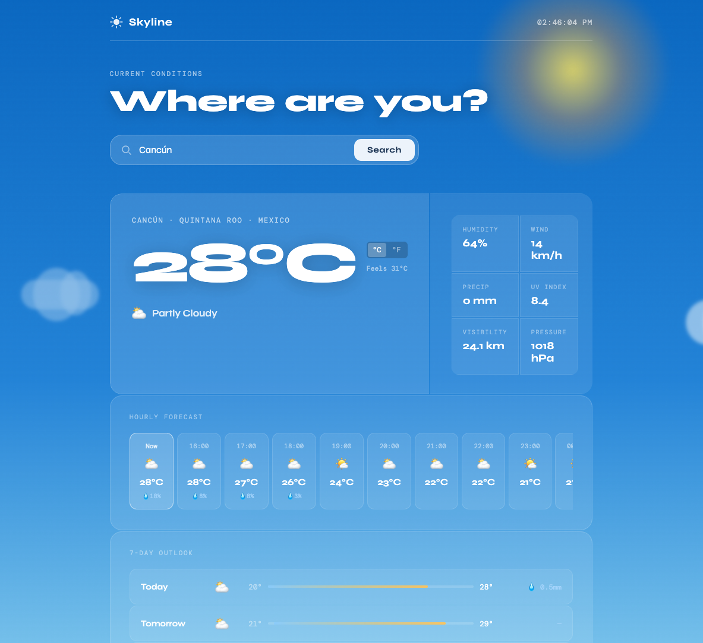

# 🌤️ Skyline — Weather Dashboard

A clean, atmospheric weather dashboard with dynamic backgrounds, built with vanilla HTML, CSS, and JavaScript. No frameworks, no build tools, no API key required.

**[Live Demo →](https://skyline.jaysonsandhu.com)** &nbsp;|&nbsp; **[Portfolio →](https://jaysonsandhu.com)**



---

## Why This Project

This project was built to demonstrate how real-time API data can be translated into a polished, interactive user experience without relying on frameworks or build tools.

---

## Features

- **Real-time weather** — current conditions including temperature, humidity, wind, UV index, pressure, and visibility
- **Dynamic sky engine** — background adapts in real time with animated sun, moon, clouds, rain, snow, and lightning
- **Hourly forecast** — next 24 hours with precipitation probability
- **7-day outlook** — daily high/low with visual temperature range bars
- **Sunrise & sunset** — live sun position arc based on current time
- **City search** — search any city in the world with autocomplete suggestions
- **°C / °F toggle** — switch units without re-fetching data
- **No API key** — powered entirely by the free Open-Meteo API
- **Responsive** — works on mobile, tablet, and desktop

---

## Tech Stack

| Layer | Choice | Why |
|---|---|---|
| Frontend | Vanilla HTML/CSS/JS | No build tools, easy to deploy anywhere |
| Weather API | [Open-Meteo](https://open-meteo.com) | Free, no key required, high quality data |
| Geocoding | [Open-Meteo Geocoding](https://open-meteo.com/en/docs/geocoding-api) | Paired geocoding API, also free |
| Fonts | Google Fonts (Syne + DM Mono) | Loaded via CDN |
| Hosting | Vercel | Zero-config static deployment |

---

## Getting Started

No setup required. Just open the file:

```bash
git clone https://github.com/jayson-s/skyline-weather-dashboard.git
cd skyline-weather-dashboard
open index.html   # macOS
# or just drag index.html into your browser
```

That's it. No `npm install`, no `.env` file, no configuration.

---

## Project Structure

```
skyline-weather-dashboard/
├── index.html   # Markup and layout
├── style.css    # All styles and animations
├── app.js       # API calls, data rendering, interactivity
└── README.md
```

---

## API Reference

This project uses two Open-Meteo endpoints — both completely free and requiring no authentication.

**Geocoding** (city search + autocomplete):
```
GET https://geocoding-api.open-meteo.com/v1/search?name={city}&count=5
```

**Forecast** (current + hourly + daily):
```
GET https://api.open-meteo.com/v1/forecast
  ?latitude={lat}&longitude={lon}
  &current=temperature_2m,weather_code,...
  &hourly=temperature_2m,weather_code,precipitation_probability
  &daily=weather_code,temperature_2m_max,temperature_2m_min,...
  &forecast_days=7
```

---

## What I Learned

- Consuming a REST API with `fetch` and handling async/await error states
- Structuring a multi-file vanilla JS project without a framework
- Translating raw API data (WMO weather codes) into human-readable UI
- Responsive CSS layout using CSS Grid and custom properties
- Deploying a static site with a custom subdomain

---

## License

MIT — free to use, fork, and modify.

---

*Built by [Jayson Sandhu](https://jaysonsandhu.com)*
